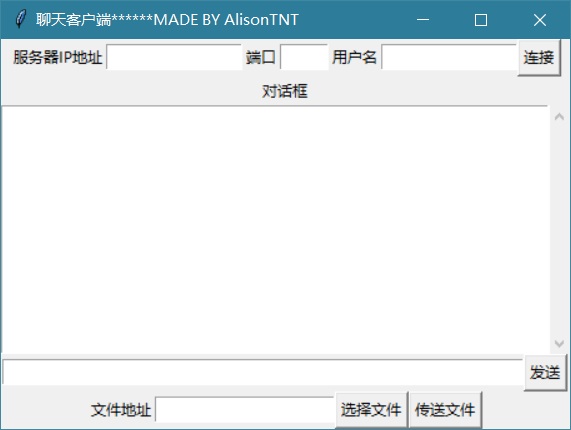
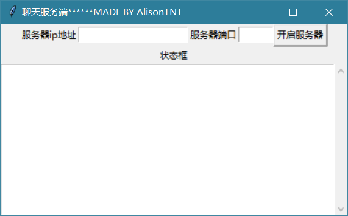
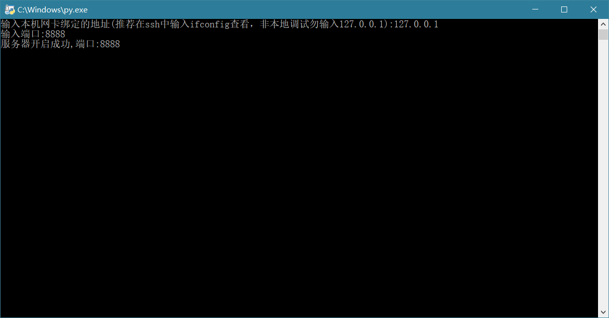

# TCP-Chat

一个基于python的聊天程序（目前只有群聊，但伏笔也有了，私聊不是问题），支持收发文件

## 特点（不是优点😔）

* 没有使用第三方库，无需pip，能跑python的地方就能运行
* 基于TCP，可以公网聊天
* 只开一个端口就能聊天收发文件，服务端即使在内网穿透后也可以公网聊天
* 待续

## 原理📚

界面基于特别丑的tkinter，程序的截图如下：

客户端界面

服务端界面

命令行版服务端界面

基于socket，原理很简单。利用一些关键字来传输命令。目前的关键字有：

* file:告知服务端和客户端要传文件
* quit:告知服务端退出

关键字当然不能给客户使用啦，所以默认客户发出的文字信息头部会加上客户的用户名，如：

AlisonTNT:file

如果是要传文件，则程序只会发送：

file

对于普通的文本消息，服务端首先会接收，然后试着去解码内容看是关键字还是对话内容。如果是对话内容，则通过一个for循环发送给除发送方以外的人

在服务端中，常开一个线程，用来监听是否有新的用户加入。当有新的用户加入，则把该用户的套接字存入一个列表中，同时开启一个新的线程与这个用户通信。

⚠后续应该会把list换成dict，将用户名和套接字分别存为键和值，以实现私聊的功能。

当有用户提出要传送文件时，则要把一个file_flag置1，说明现在的通道有用户正在传输文件，要阻塞其他用户发送消息。当文件传输完毕后，重新将file_flag置0，开启通道。

file_flag又分为两个，一个是在对话线程内的，一个是全局的。对话线程内的主要是告诉服务器现在正在接收文件即二进制信息，不要进行utf8的转码，全局的就起到阻塞作用。

在客户端同样有一个send_file_flag,当正在传输文件时不允许不允许再开一个传输文件的线程。

## TODO🕐
* 加入私聊
* 加入加密功能
* 把安卓也加进来
* 感觉commond版有点傻，估计要改改

## 注意事项🚦

服务端说要输入ip地址，除非你在本地使用输入127.0.0.1，否则请输入你网卡绑定的ip地址。对于一些云服务器来说，网卡绑定的ip地址不一定就是你的公网地址，比如蛋疼的疼讯云就是10.X.X.X。

## 后记🌎

其实我打算做一个开源的跨平台的轻量级的可自定义加密的TCP聊天程序。

以嘲笑一下tc聊天软件所谓的加密&&社区送温暖

最后，这种作业式的程序不可避免地会有很多Bug，要是有，请联系我[supertnt@foxmail.com](mailto:supertnt@foxmail.com)